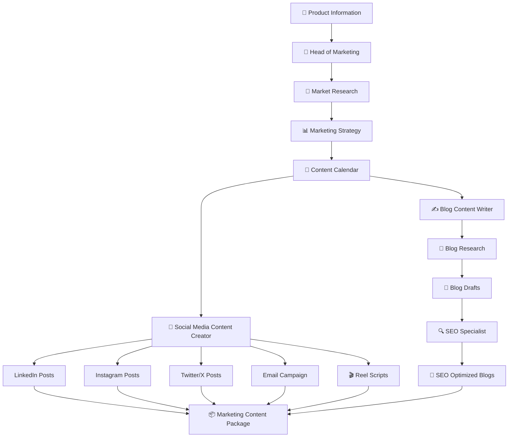

# 🤖 AI Marketing Crew — Multi-Agent Marketing Automation

> **Turn a product idea into a complete, research-backed marketing plan and content package using a team of specialized AI agents.**

<div align="center">

### 🧠 Research → Strategy → Planning → Content → SEO

**Built with CrewAI + Gemini + Web Research + File-based Collaboration**

</div>

---

## 📌 What is this project?

Marketing usually requires several different people:

- 🔎 Market Researcher
- 📊 Marketing Strategist
- 📱 Social Media Content Creator
- ✍️ Blog Writer
- 🔍 SEO Specialist

Instead of asking one AI agent to do everything, this project creates a **team of specialized AI agents** that collaborate through a sequential workflow.

The system takes information about a product and target audience and produces:

- Market research
- Marketing strategy
- Weekly content calendar
- Social media drafts
- Email campaign drafts
- Instagram Reel scripts
- Blog research
- Blog drafts
- SEO-optimized blog content

---

# 🎯 Project Goal

The goal is not simply:

> "Generate some marketing content."

The goal is:

> **Research the market → understand the audience → create a strategy → plan the content → generate platform-specific content → optimize the blogs for SEO.**

This makes the project an example of **multi-agent workflow orchestration**, rather than a single LLM prompt.

---

# 🧩 How the system works



---

# 🧠 Meet the AI Team

The system currently contains **4 specialized agents**.

<details>
<summary>👔 1. Head of Marketing</summary>

### Responsibility

Acts as the strategic marketing lead.

### Main responsibilities

- Conduct market research
- Understand customer needs
- Analyze competitors
- Identify market opportunities
- Build the overall marketing strategy

### Tools

- Web search
- Website scraping
- File reading
- File writing
- Access to previous project drafts

### Output

```text
Market Research
        ↓
Marketing Strategy
```

</details>

<details>
<summary>📱 2. Social Media Content Creator</summary>

### Responsibility

Turns the marketing strategy into platform-specific content.

### Creates

- LinkedIn posts
- Instagram posts
- Twitter/X posts
- Email campaigns
- Instagram Reel scripts

### Output

```text
Marketing Strategy
        ↓
Content Calendar
        ↓
Platform-specific Content
```

</details>

<details>
<summary>✍️ 3. Blog Content Writer</summary>

### Responsibility

Researches and creates long-form blog content.

### Process

```text
Content Strategy
      ↓
Blog Research
      ↓
Blog Topics
      ↓
Blog Drafts
```

### Research includes

- Keyword analysis
- Competitor blogs
- Industry trends
- Suggested topics
- Blog outlines

</details>

<details>
<summary>🔍 4. SEO Specialist</summary>

### Responsibility

Optimizes the drafted blogs for search engines.

### Focus areas

- Keyword optimization
- SEO-friendly titles
- Headings
- Meta descriptions
- Internal linking
- Organic traffic optimization

### Process

```text
Blog Draft
    ↓
SEO Optimization
    ↓
Publication-ready Blog
```

</details>

---

# 🔄 Complete Agent Workflow

The workflow is executed sequentially using CrewAI.

```text
                    PRODUCT INPUT
                         │
                         ▼
              ┌────────────────────┐
              │  HEAD OF MARKETING │
              └─────────┬──────────┘
                        │
                        ▼
                 MARKET RESEARCH
                        │
                        ▼
              MARKETING STRATEGY
                        │
                        ▼
               CONTENT CALENDAR
                        │
              ┌─────────┴─────────┐
              ▼                   ▼
      SOCIAL MEDIA TEAM      BLOG WRITER
              │                   │
       ┌──────┼──────┐            ▼
       ▼      ▼      ▼      BLOG RESEARCH
    Posts   Email  Reels          │
       │      │      │            ▼
       │      │      │        BLOG DRAFTS
       │      │      │            │
       │      │      │            ▼
       │      │      │       SEO SPECIALIST
       │      │      │            │
       └──────┴──────┴────────────┘
                    │
                    ▼
          COMPLETE MARKETING
             CONTENT PACKAGE
```

---

# 📥 What goes into the system?

The system accepts product information such as:

```text
Product Name
Product Description
Target Audience
Budget
Current Date
```

### Example

```text
Product Name:
AI Powered Excel Automation Tool

Target Audience:
Small and Medium Enterprises (SMEs)

Product Description:
A tool that automates repetitive tasks in Excel
using AI, saving time and reducing errors.

Budget:
₹50,000
```

---

# 📤 What comes out?

The system generates a complete marketing package.

## 1️⃣ Market Research

```text
Market Trends
Competitor Analysis
Customer Insights
Market Opportunities
Marketing Recommendations
```

⬇️

## 2️⃣ Marketing Strategy

```text
Target Audience Segmentation
Positioning
Messaging
Marketing Channels
Budget
KPIs
Weekly Action Plan
```

⬇️

## 3️⃣ Content Calendar

```text
Topics
Formats
Publishing Schedule
Campaign Themes
```

⬇️

## 4️⃣ Social Media Content

```text
LinkedIn
Instagram
Twitter/X
Email Campaigns
```

⬇️

## 5️⃣ Reel Scripts

```text
Hook
Key Message
Call To Action
```

⬇️

## 6️⃣ Blog Content

```text
Blog Research
Keyword Analysis
Competitor Insights
Blog Topics
Blog Drafts
```

⬇️

## 7️⃣ SEO Optimization

```text
SEO Titles
Headings
Keywords
Meta Descriptions
Internal Links
```

---

# 🗂️ Why are the `resources/drafts/` files included?

One of the important design choices in this project is that the system doesn't only produce a final answer.

It stores the **intermediate outputs** generated during the workflow.

This makes the reasoning pipeline easier to inspect.

```text
resources/
└── drafts/
    │
    ├── market_research_report.md
    │
    ├── marketing_strategy.md
    │
    ├── content_calendar.md
    │
    ├── blogs/
    │   ├── blog_research_report.md
    │   └── ...
    │
    ├── posts/
    │   ├── linkedin_drafts.md
    │   ├── instagram_drafts.md
    │   ├── twitter_drafts.md
    │   ├── email_sequence_drafts.md
    │   ├── combined_drafts.md
    │   └── final_drafts.json
    │
    └── reels/
        └── reels_scripts.md
```

### Why this matters

Instead of:

```text
Input → 🤖 AI → Final Answer
```

you can inspect:

```text
Input
  ↓
Research
  ↓
Strategy
  ↓
Content Planning
  ↓
Drafts
  ↓
SEO
  ↓
Final Content
```

This makes the project much easier to understand, debug and improve.

---

# 🛠️ Tools & Technologies

| Technology | Purpose |
|---|---|
| 🧠 CrewAI | Multi-agent orchestration |
| ✨ Gemini | LLM powering the agents |
| 🔎 Serper | Web search |
| 🌐 ScrapeWebsiteTool | Website research |
| 📂 DirectoryReadTool | Read project resources |
| 📝 FileWriterTool | Save generated outputs |
| 📖 FileReadTool | Read previous outputs |
| 🐍 Python | Application logic |
| 📦 Pydantic | Structured content output |
| 🔐 dotenv | Environment variables |
| ⚡ UV | Dependency/environment management |

---

# 🧱 Project Architecture

```text
marketing-with-crewai-agents/
│
├── config/
│   ├── agents.yaml
│   └── tasks.yaml
│
├── resources/
│   └── drafts/
│       ├── blogs/
│       ├── posts/
│       └── reels/
│
├── main.py
├── marketingcrew.py
│
├── .env.example
├── .gitignore
├── pyproject.toml
├── uv.lock
└── README.md
```

---

# 📁 Important Files

<details>
<summary>⚙️ config/agents.yaml</summary>

Contains the definitions of the AI agents:

- Role
- Goal
- Backstory
- LLM configuration

This keeps agent configuration separate from Python orchestration logic.

</details>

<details>
<summary>📋 config/tasks.yaml</summary>

Contains the tasks performed by the agents.

Examples:

```text
market_research
prepare_marketing_strategy
create_content_calendar
prepare_post_drafts
prepare_scripts_for_reels
content_research_for_blogs
draft_blogs
seo_optimization
```

</details>

<details>
<summary>🧠 marketingcrew.py</summary>

This is the core orchestration layer.

It:

- Creates agents
- Assigns tools
- Creates tasks
- Defines structured outputs
- Builds the Crew
- Runs the workflow sequentially

The project uses:

```python
Process.sequential
```

and also enables CrewAI planning.

</details>

<details>
<summary>🚀 main.py</summary>

This file currently contains a small Gemini API connectivity test.

The main CrewAI workflow is implemented in:

```text
marketingcrew.py
```

</details>

---

# 🧪 Structured Output

For several content-generation tasks, the project uses a Pydantic model:

```python
class Content(BaseModel):
    content_type: str
    topic: str
    target_audience: str
    tags: List[str]
    content: str
```

This helps convert free-form LLM responses into a predictable structure.

Example:

```json
{
  "content_type": "linkedin_post",
  "topic": "AI Excel Automation",
  "target_audience": "SMEs",
  "tags": ["AI", "Automation", "Excel"],
  "content": "..."
}
```

---

# 🔧 Agent Tools

The agents can work with external information and project files.

```text
             AI AGENT
                │
       ┌────────┼────────┐
       ▼        ▼        ▼
    Web Search Scraping  Files
       │        │        │
       └────────┼────────┘
                ▼
          AI Reasoning
                │
                ▼
             Output
```

The project uses:

- `SerperDevTool`
- `ScrapeWebsiteTool`
- `DirectoryReadTool`
- `FileWriterTool`
- `FileReadTool`

---

# 🚀 Getting Started

## 1. Clone the repository

```bash
git clone <your-repository-url>
cd marketing-with-crewai-agents
```

## 2. Install dependencies

This project uses UV.

```bash
uv sync
```

## 3. Configure environment variables

Create a `.env` file:

```env
GOOGLE_API_KEY=
SERPER_API_KEY=
```

Never commit your real API keys.

The repository contains `.env.example` as a template.

---

# ▶️ Running the Crew

The main CrewAI workflow can be started through the project entry point.

Make sure your environment variables are configured first.

Then run the project using your configured CrewAI/UV command.

---

# 🔍 Example Execution

The project currently demonstrates a marketing workflow for:

```text
Product:
AI Powered Excel Automation Tool

Audience:
Small and Medium Enterprises

Budget:
₹50,000
```

The system then works through:

```text
Market Research
       ↓
Marketing Strategy
       ↓
Content Calendar
       ↓
Social Media Content
       ↓
Reel Scripts
       ↓
Blog Research
       ↓
Blog Drafts
       ↓
SEO Optimization
```

---

# 💡 Why Multi-Agent instead of One Agent?

A single general-purpose agent could theoretically perform all of these tasks.

But separating responsibilities provides several advantages:

### 🎯 Specialization

Each agent has a specific role and objective.

### 🔄 Modular workflow

Individual tasks can be changed without redesigning the entire system.

### 🧪 Inspectability

Intermediate artifacts can be inspected in `resources/drafts/`.

### 📈 Extensibility

New agents can be added for:

- Paid advertising
- Email marketing
- Competitor intelligence
- Brand analysis
- Analytics
- Customer research

---

# 🧠 What I Learned From This Project

This project helped me understand how to move from:

```text
Single LLM Prompt
        ↓
Multiple Specialized Agents
        ↓
Agentic Workflow
        ↓
Tool-using Agents
        ↓
Structured Outputs
        ↓
Persistent Intermediate Artifacts
```

It also helped me understand:

- CrewAI agent design
- YAML-based configuration
- Task orchestration
- Sequential agent workflows
- Tool-using agents
- Structured outputs with Pydantic
- Web research with AI agents
- File-based agent collaboration
- Prompt/task design
- Environment variable management

---

# 🚧 Current Limitations

This project is currently a learning/portfolio implementation.

Some areas that can be improved:

- Human approval/review between major stages
- Better error handling
- Persistent memory
- More robust output validation
- Automated evaluation of generated content
- Better cost/token tracking
- Production API layer
- Frontend interface
- Observability and tracing
- Parallel task execution where appropriate

---

# 🔮 Future Roadmap

```text
[x] Multi-agent marketing workflow
[x] Market research
[x] Marketing strategy
[x] Content calendar
[x] Social media drafts
[x] Reel scripts
[x] Blog research
[x] Blog generation
[x] SEO optimization

[ ] Human-in-the-loop review
[ ] Streamlit/Web UI
[ ] Marketing analytics agent
[ ] Brand voice knowledge base
[ ] Long-term memory
[ ] Automated quality evaluation
[ ] Content approval workflow
[ ] Production API
```

---

# ⭐ Project Highlights

```text
🤖 4 Specialized AI Agents
📋 8 Marketing Tasks
🔎 Web Research
🧠 Gemini-powered reasoning
📱 Multi-platform content generation
📝 Structured outputs
📂 Persistent intermediate artifacts
🔍 SEO optimization
⚙️ Sequential CrewAI orchestration
```

---

# 👨‍💻 Author

**Vishv Pandya**

Built as a hands-on exploration of:

> **Generative AI • Agentic AI • CrewAI • LLM Applications • Multi-Agent Systems**

---

<div align="center">

### 🚀 From Product Idea → Marketing Strategy → Content → SEO

**Built with curiosity, experimentation and AI agents.**

</div>